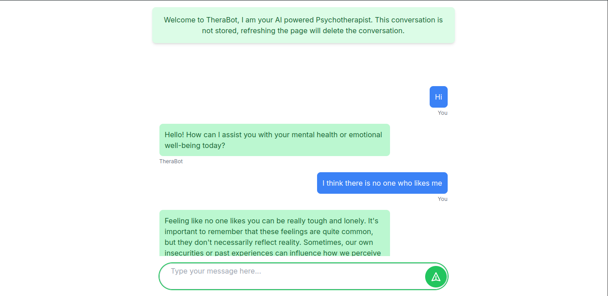

# TheraBot-AI

TheraBot-AI is an AI-powered therapy chatbot that provides support and guidance to individuals dealing with mental health issues. This project aims to create a safe and accessible platform for people to seek help and find solace in their journey towards mental well-being.

## Installation

To get started with TheraBot-AI, follow these steps:

1. Clone the repository:

    ```bash
    git clone https://github.com/your-username/TheraBot-AI.git
    ```

2. Navigate to the project directory:

    ```bash
    cd TheraBot-AI
    ```

3. Install the dependencies:

    ```bash
    npm install
    # or
    yarn install
    ```

4. Start the development server:

    ```bash
    npm run dev
    # or
    yarn dev
    ```

5. Open [http://localhost:3000](http://localhost:3000) in your browser to access TheraBot-AI.

## Usage

Once the development server is running, you can start using TheraBot-AI by following the on-screen instructions. The chatbot will provide a conversational interface where you can express your thoughts and feelings, and it will offer support and guidance based on AI algorithms.

## Contributing

We welcome contributions to enhance TheraBot-AI and make it more effective in helping individuals with mental health issues. If you would like to contribute, please follow these steps:

1. Fork the repository on GitHub.

2. Create a new branch for your feature or bug fix.

3. Make the necessary changes and commit them.

4. Push your changes to your forked repository.

5. Submit a pull request to the main repository.

## License

TheraBot-AI is licensed under the [MIT License](LICENSE).


## Deploy on Vercel

The easiest way to deploy your Next.js app is to use the [Vercel Platform](https://vercel.com/new?utm_medium=default-template&filter=next.js&utm_source=create-next-app&utm_campaign=create-next-app-readme) from the creators of Next.js.

Check out our [Next.js deployment documentation](https://nextjs.org/docs/deployment) for more details.
